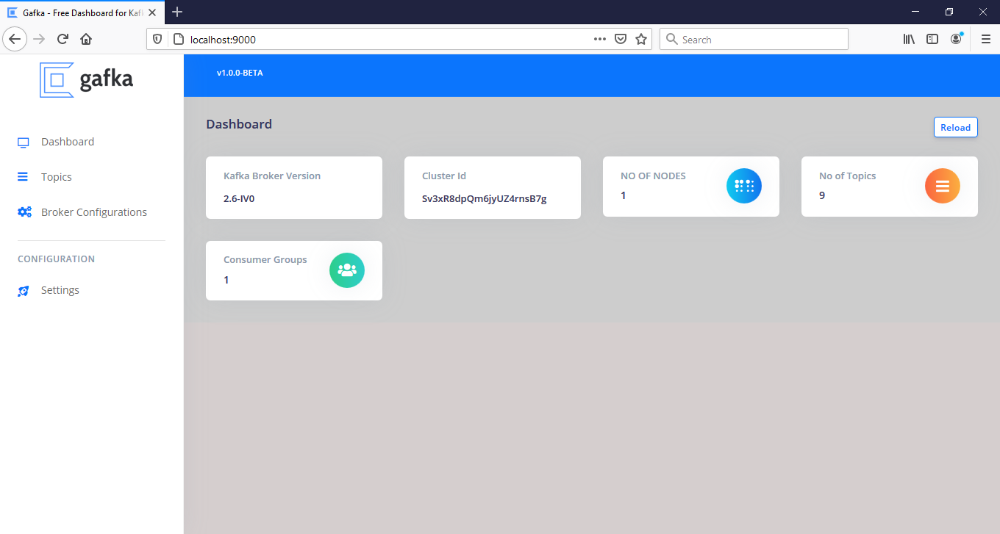
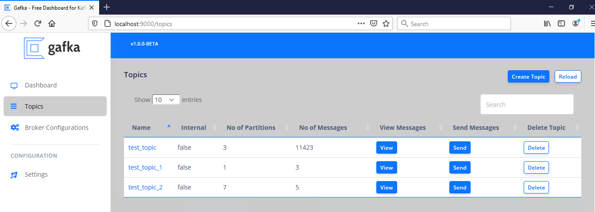
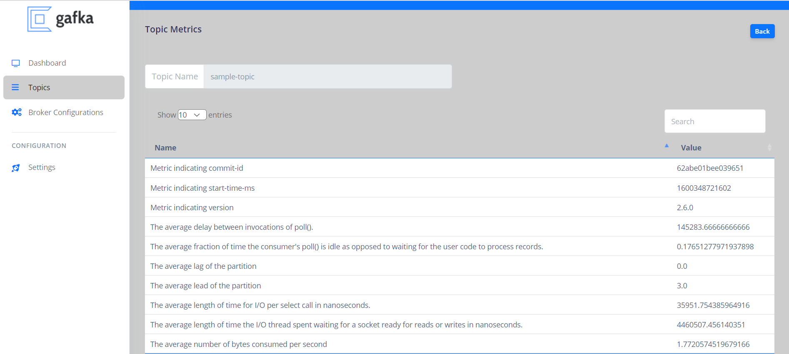
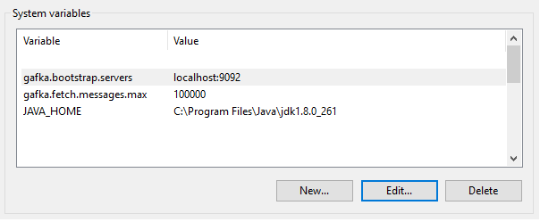

### Download Gafka latest beta release 
<a class="btn" href="https://github.com/isurujayakantha/gafka-releases/releases/download/v1.1.0/gafka-v1.1.0.zip" class="btn">Gafka-v1.1.0-64-Bit-Release.zip</a> 

## Welcome to Gafka

Gafka is a free GUI application for managing and using Apache Kafka ® clusters. It provides an intuitive UI that allows one to quickly view objects within a Kafka cluster as well as the messages stored in the topics of the cluster. It contains features geared towards both developers and administrators..





## Getting Started with Gafka

```markdown

# Step 1 : Download and extract the .zip file to your PC.
# Step 2 : Create below environment variables (change the configuration if you run kafka broker in a deferent port)
```


```markdown
# Env variables Examples (Key::Value). 
# gafka.bootstrap.servers::localhost:9092
# gafka.bootstrap.servers.username::isuru
# gafka.bootstrap.servers.password::test

Please note that below attribute is deprecated and not required
# gafka.fetch.messages.max::10000
```

```markdown
# Step 3 : Make sure kafka broker is up and running. 
# Step 4 : Open command line and type "java -jar gafka-v1.0.0-BETA.jar".
# Step 5 : If gafka is successfully up and running open any web browser.
# Step 6 : type "http://localhost:9000" in browser and hit enter.

```

```markdown
# You can customize to run in a defferent port with below command. 
# "java -jar gafka-v1.0.0-BETA.jar --server.port=7000".
#If gafka is successfully up and running open any web browser.
#type "http://localhost:7000" in browser and hit enter.

```

### Support or Contact
 
For any product related inquiries, comments or suggestions, contact isurujayakantha@outlook.com. 
